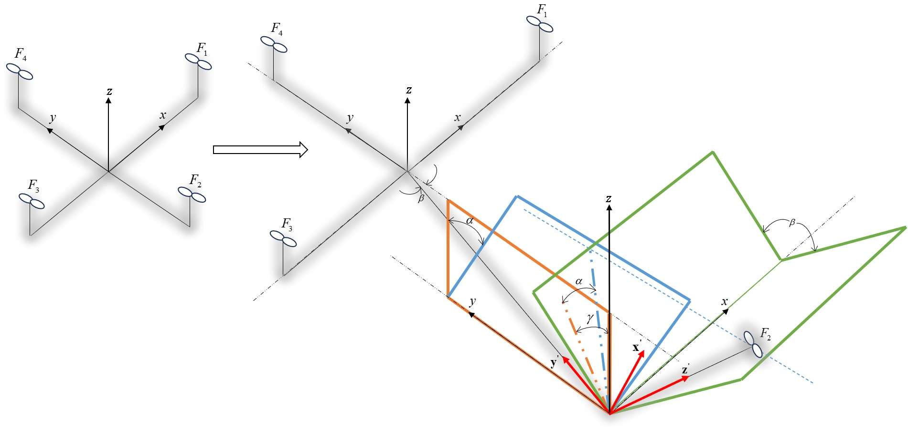

# 🚁 Genetic Algorithm-Based Non-singular Fast Terminal Sliding Mode Control of a Quadrotor with Thrust and Mechanical Link Deflection Fault

This repository presents the design and implementation of an **Optimal Fault-Tolerant Terminal Sliding Mode Control** for a quadrotor UAV subject to **Structural faults**, specifically **rotor thrust and mechanical link deviation**.

The control scheme integrates a **Genetic Algorithm (GA)** optimization and **Radial-Basis-Function Neural Networks (RBFNN)** to optimize the switching and fast controller parameters, to reduce overshoots, to minimuize control efforts, and to estimate the time-varying behavior of fault terms. Comparative simulation studies with a **Nonsingular Fast Terminal Sliding Mode Control (NFTSMC)** and **Disturbance-Observer-Based TSMC** are provided, as wel.

---------------------------------------

## ⚙️ Fault Description and Dynamics

During flight or maneuvering, a drone may inevitably experience structural damage due to collisions with rigid objects, such as another UAV, a tree, or even an obstacle. Such incidents may cause one of the thrust forces of the drone to no longer operate in a vertical direction. It is important to emphasize that this collision does not necessarily degrade the motor efficiency but merely alters its orientation. The angles of deviation caused by such collision are demonstrated in Figure.
The Assumptions regarding the mathematical modeling are described as follows:

**Assumption 1.** The position of the center of mass is constant after the fault occurrence.
**Assumption 2.** The symmetry of the moment of inertia will not change after the fault occurrence.
**Assumption 3.** After the fault occurrence, the moment of inertia and the mass value of the drone will not change.

The deflections from vertical directions add additional nonlinear terms to the system dynamics mathematically expressed as:

$$
\begin{aligned}
\ddot{x} &= (s_{\phi}s_{\psi} + c_{\phi} s_{\theta} c_{\psi}) \frac{u_T}{m} - \frac{K_f}{m} \dot{x} + f_{stx} \\
\ddot{y} &= (-s_{\phi} c_{\psi} + c_{\phi} s_{\theta} s_{\psi}) \frac{u_T}{m} - \frac{K_f}{m} \dot{y} + f_{sty} \\
\ddot{z} &= -g + (c_{\phi} c_{\theta}) \frac{u_T}{m} - \frac{K_f}{m} \dot{z} + f_{stz} \\
\ddot{\phi} &= \left(\frac{I_y - I_z}{I_x}\right) \dot{\theta} \dot{\psi} + \frac{J_{TP}}{I_x} \dot{\theta} \omega^* + \frac{u_\phi}{I_x} - \frac{K_tL}{I_x} \dot{\phi} + f_{st\phi} \\
\ddot{\theta} &= \left(\frac{I_z - I_x}{I_y}\right) \dot{\phi} \dot{\psi} - \frac{J_{TP}}{I_y} \dot{\phi} \omega^* + \frac{u_\theta}{I_y} - \frac{K_tL}{I_y} \dot{\theta} + f_{st\theta} \\
\ddot{\psi} &= \left(\frac{I_x - I_y}{I_z}\right) \dot{\phi} \dot{\theta} + \frac{u_\psi}{I_z} - \frac{K_tL}{I_z} \dot{\psi} + f_{st\psi}
\end{aligned}
$$

where:

$$
\begin{aligned}
f_{stx} &= \frac{b}{m} \omega_2^2 \left( f_1 \cos\theta \cos\psi + f_2 (\cos\psi \sin\phi \sin\theta - \cos\phi \sin\psi) + f_3 (\sin\phi \sin\psi + \cos\phi \cos\psi \sin\theta) \right) \\
f_{sty} &= \frac{b}{m} \omega_2^2 \left( f_1 \cos\theta \sin\psi + f_2 (\sin\psi \sin\phi \sin\theta + \cos\phi \sin\psi) + f_3 (-\sin\phi \cos\psi + \cos\phi \sin\psi \sin\theta) \right) \\
f_{stz} &= \frac{b}{m} \omega_2^2 \left( -f_1 \sin\theta + f_2 (\sin\phi \cos\theta) + f_3 (\cos\phi \cos\theta) \right) \\
f_{st\phi} &= \frac{J_{TP}}{I_x} \omega_2 (f_2 \dot{\psi} - f_3 \dot{\theta}) + \frac{1}{I_x} \omega_2^2 (b l f_4 + f_1 d) \\
f_{st\theta} &= \frac{J_{TP}}{I_y} \omega_2 (f_1 \dot{\psi} + f_3 \dot{\phi}) + \frac{1}{I_y} \omega_2^2 (b l f_5 - f_2 d) \\
f_{st\psi} &= -\frac{J_{TP}}{I_z} \omega_2 (f_2 \dot{\phi} + f_1 \dot{\theta}) - \frac{1}{I_z} \omega_2^2 (b l f_6 + f_3 d)
\end{aligned}
$$

and fault related terms regarding the fault angles $\alpha$, $\beta$, and $\gamma$ are expressed as follows:

$$
\begin{aligned}
f_1 &= \sin\alpha \sin\gamma \\
f_2 &= -\cos\gamma \sin\beta + \sin\gamma \cos\beta \cos\alpha \\
f_3 &= \cos\beta \cos\gamma + \cos\alpha \sin\beta \sin\gamma - 1 \\
f_4 &= f_2 \sin\beta - (1 + f_3) \cos\beta + 1 \\
f_5 &= f_1 \sin\beta \\
f_6 &= f_1 \cos\beta
\end{aligned}
$$



------------------

## 🎯 Terminal Sliding Mode Control

We may introduce the following non-singular sliding surfaces, for $i=1,3,5,7,9,11$:

$$
s_i = e_i + b_i \text{sign}^{\lambda_i}(e_i) + b_i' \,\text{sign}^{\lambda_i'}(\dot{e}_i)
$$

where $b_i' > 0$, $b_i > 0$, $1 < \lambda_i' < 2$, and $\lambda_i > 1$.  
The tracking errors and their dynamics can be defined as:

$$
e_i = X_i - X_{di}
$$

$$
\dot{e}_i = \dot{X}_i - X_{d(i+1)}
$$

$$
\ddot{e}_i = \ddot{X}_i - \dot{X}_{d(i+1)}
$$

in which:

$$
X_{di} =
\begin{bmatrix}
x_d & \dot{x}_d & y_d & \dot{y}_d & z_d & \dot{z}_d &
\phi_d & \dot{\phi}_d & \theta_d & \dot{\theta}_d &
\psi_d & \dot{\psi}_d
\end{bmatrix}^T
$$

The derivatives of the sliding surfaces can then be calculated, for $k=1,2,3,4,5,6$:

$$
\dot{s}_i =\dot{e}_i \left(1 + b_i \lambda_i |\dot{e}_i|^{\lambda_i - 1}\right)+b_i' \lambda_i' |\dot{e}_i|^{\lambda_i' - 1}

\left(f_j + g_{kk} u_k + f_{stj} - \dot{X}_{d(i+1)} \right)
$$

Since the fault vector $f_{st}$ is unknown, the nominal equivalent control law may be obtained, for $j=2,4,6,8,10,12$:

$$
u_{k,eq} =
- g_{kk}^{-1} b_i'^{-1} \lambda_i'^{-1}
|\dot{e}_i|^{2-\lambda_i'} \,\text{sign}(\dot{e}_i)
\left(1 + b_i \lambda_i |\dot{e}_i|^{\lambda_i - 1}\right)
- g_{kk}^{-1}\left(f_j - \dot{X}_{d(i+1)}\right)
$$

For the robustness of the controller against unknown external faults and disturbances, the fast-switching control may be added to the equivalent one:

$$
u_{k,sw} = - g_{kk}^{-1}\left(\eta_k s_i + K_k \,\text{sign}(s_i)\right)
$$

where $\eta_k$ and $K_k$ are positive constants.  
Hence, the final nominal control law may be derived:

$$
u_k = - g_{kk}^{-1} \Big[
b_i'^{-1} \lambda_i'^{-1} |\dot{e}_i|^{2-\lambda_i'} \,\text{sign}(\dot{e}_i)
\left(1 + b_i \lambda_i |\dot{e}_i|^{\lambda_i - 1}\right)
+ f_j - \dot{X}_{d(i+1)} + \eta_k s_i + K_k \,\text{sign}(s_i)
\Big]
$$


## 3. Optimization with Genetic Algorithm (GA)

To reduce overshoots and control efforts, the **Genetic Algorithm** optimizes controller parameters $\eta$ and $K$.

* **Cost Function:** weighted sum of tracking error and control effort.
* **Simulation Time:** 50 seconds.
* **Sampling Time:** $T_s = 0.001$ s.
* **Process:**

  1. GA generates a population of candidate parameters.
  2. Each candidate is evaluated by running the simulation.
  3. Higher-cost candidates are eliminated.
  4. Crossover and mutation generate new parameters.
  5. Optimal $\eta$ and $K$ are selected after convergence.

---

## 4. Simulation Codes

The repository provides several simulation files:

* **Main_RBFFNN_GANFTSMC.m**
  Runs the optimized **RBFNN + GA-TSMC** controller.
  Outputs system states and **3D trajectory** of the faulty quadrotor.

* **PlotComparedResults_GANFTSMC_NFTSMC.m**
  Compares **GANFTSMC** with **standard NFTSMC**.

* **Final_SecondTrajectory.m**
  Shows results of **Disturbance-Observer-Based TSMC** for additional comparison.

---

## 5. Results

### 5.1 Trajectory Tracking

* GANFTSMC achieves accurate path tracking even under rotor deviation.
* NFTSMC shows larger overshoots.

### 5.2 Control Efforts

* GANFTSMC reduces input magnitudes while maintaining robustness.

### 5.3 Fault Tolerance

* Tracking errors converge to zero in finite time despite **structural faults**.

(Plots and figures are included in the `figures/` folder.)

---

## 6. Repository Structure

```
├── src/                        # MATLAB or Python source files
├── simulations/                # Simulation scripts
├── figures/                    # Plots and figures
├── README.md                   # Project documentation
```

---

## 7. How to Use

1. Clone this repository:

   ```bash
   git clone https://github.com/YourUsername/Quadrotor-TSMC-Fault-Tolerant.git
   ```

2. Open MATLAB.

3. Run the following main scripts:

   * `Main_RBFFNN_GANFTSMC.m` → optimized controller simulation.
   * `PlotComparedResults_GANFTSMC_NFTSMC.m` → comparison plots.
   * `Final_SecondTrajectory.m` → disturbance observer-based TSMC.

----------------
